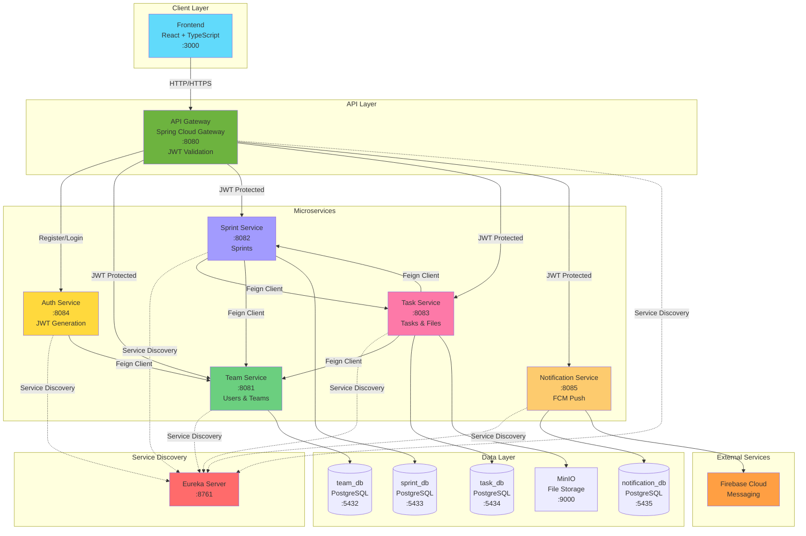
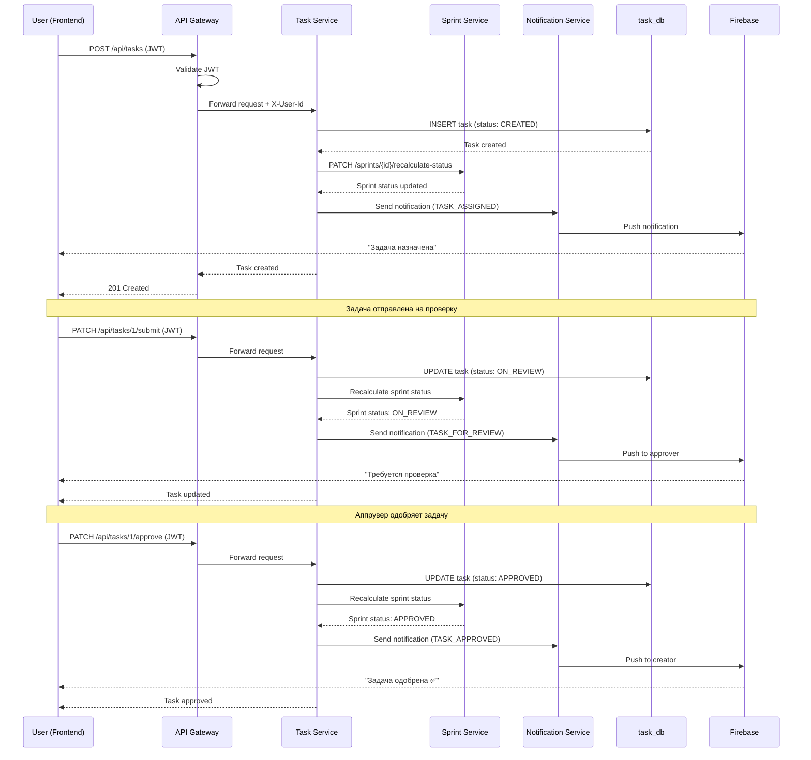
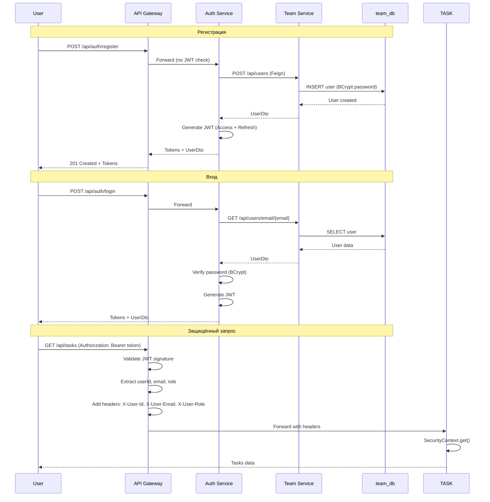
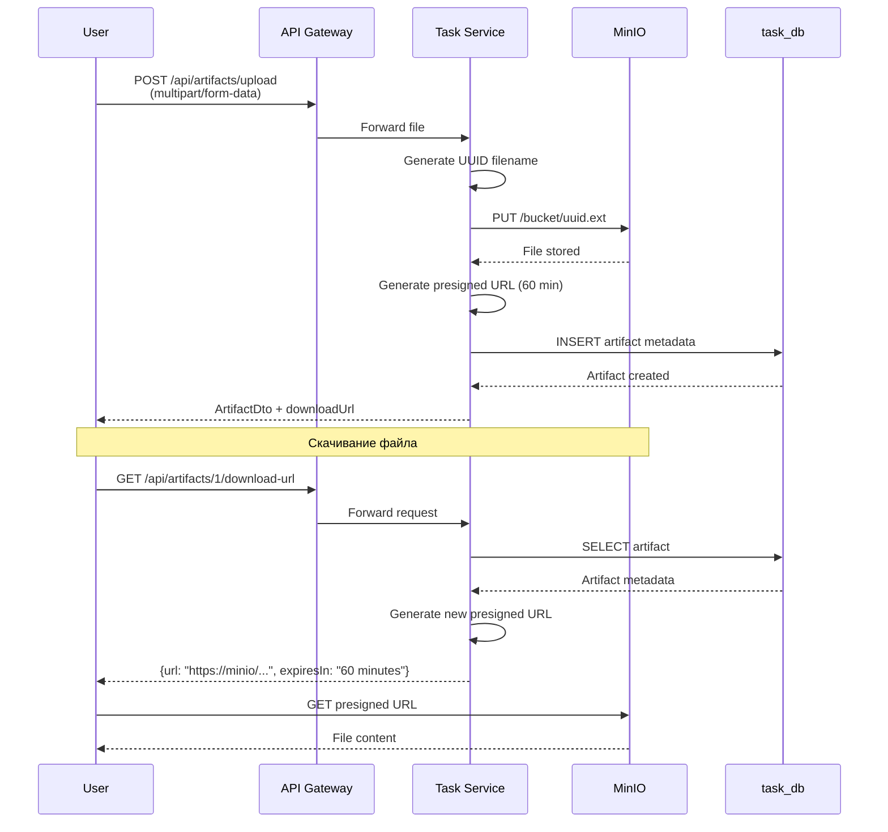
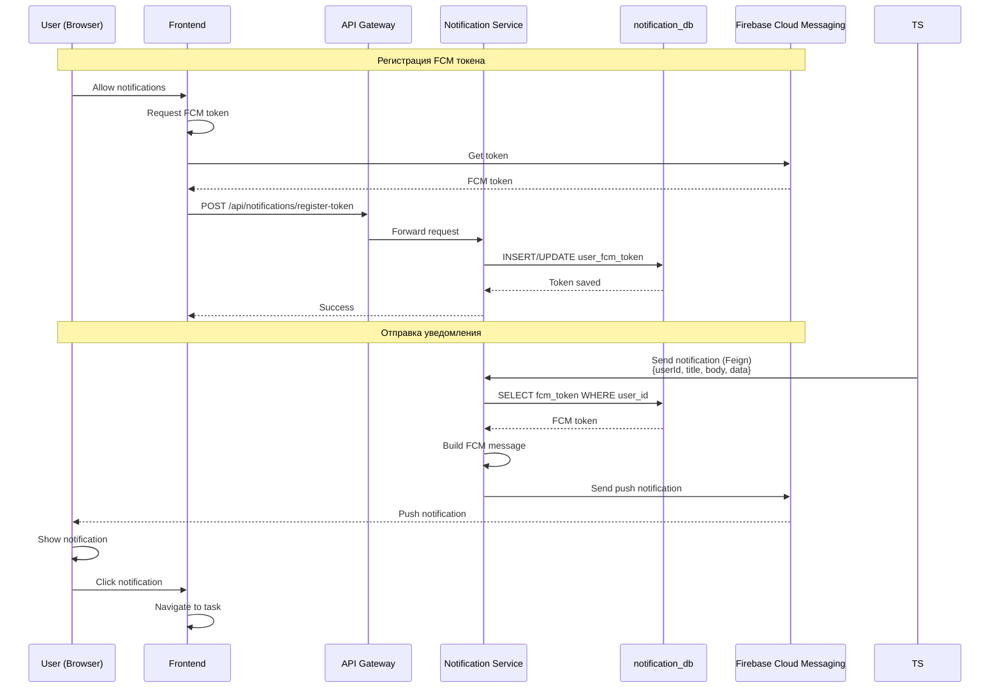
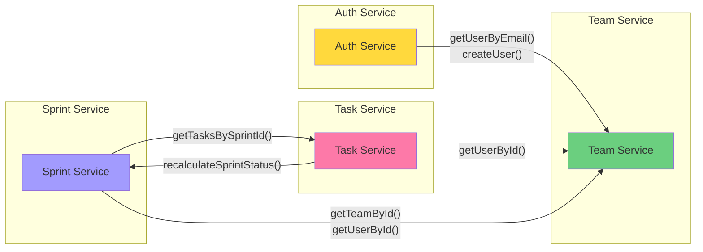
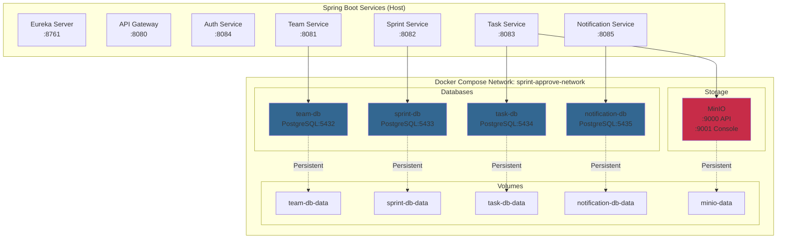
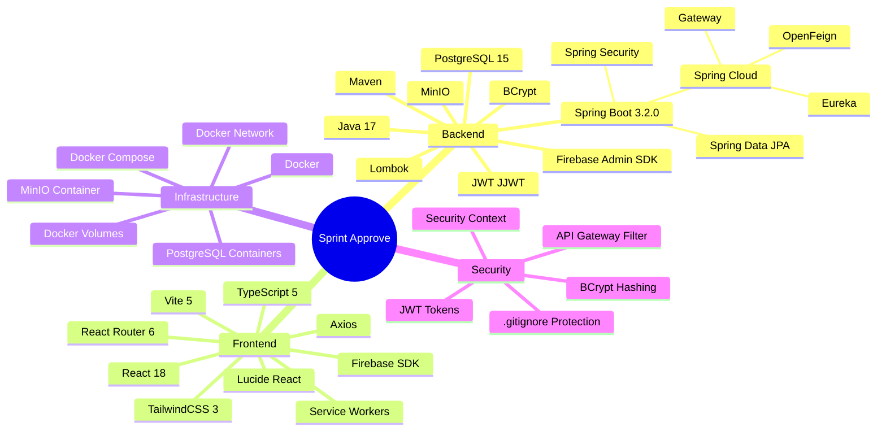
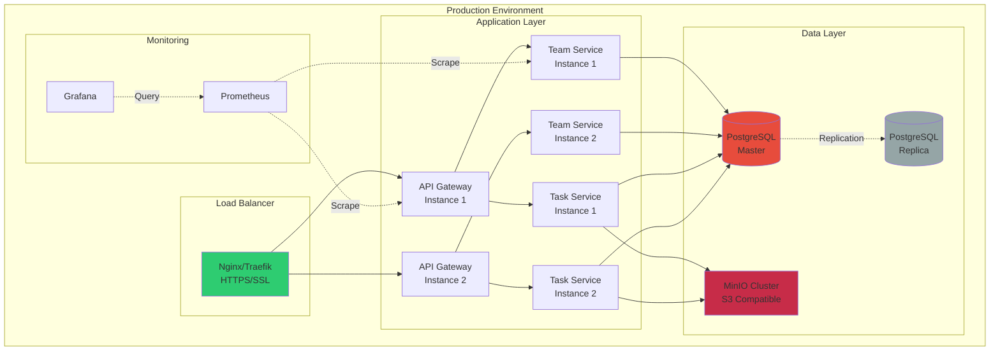

# 🏗️ Sprint Approve - Архитектурные диаграммы

## 📊 Общая архитектура



---

## 🔄 Workflow: Создание и одобрение задачи



---

## 🔐 JWT Authentication Flow



---

## 📁 File Upload Flow (MinIO)



---

## 🔔 Push Notification Flow (FCM)



---

## 🔗 Service Integration (OpenFeign)



---

## 🗄️ Database Schema

```mermaid
erDiagram
    USERS ||--o{ TEAMS : "belongs to"
    TEAMS ||--o{ SPRINTS : "has"
    SPRINTS ||--o{ TASKS : "contains"
    TASKS ||--o{ ARTIFACTS : "has"
    TASKS ||--o{ COMMENTS : "has"
    USERS ||--o{ USER_FCM_TOKENS : "has"

    USERS {
        bigint id PK
        varchar email UK
        varchar name
        varchar password
        bigint team_id FK
        varchar role
        timestamp created_at
        timestamp updated_at
    }

    TEAMS {
        bigint id PK
        varchar name
        text description
        timestamp created_at
        timestamp updated_at
    }

    SPRINTS {
        bigint id PK
        varchar name
        bigint team_id FK
        date start_date
        date end_date
        varchar status
        bigint created_by FK
        timestamp created_at
        timestamp updated_at
    }

    TASKS {
        bigint id PK
        varchar title
        text description
        bigint sprint_id FK
        bigint assigned_to FK
        bigint approver_id FK
        bigint created_by FK
        varchar status
        timestamp created_at
        timestamp updated_at
    }

    ARTIFACTS {
        bigint id PK
        varchar name
        varchar url
        bigint task_id FK
        bigint uploaded_by FK
        varchar file_type
        bigint file_size
        timestamp created_at
    }

    COMMENTS {
        bigint id PK
        bigint task_id FK
        bigint author_id FK
        text content
        timestamp created_at
        timestamp updated_at
    }

    USER_FCM_TOKENS {
        bigint id PK
        bigint user_id FK UK
        varchar fcm_token
        timestamp created_at
        timestamp updated_at
    }
```

---

## 🐳 Docker Infrastructure



---

## 📊 Technology Stack Overview



---

## 🎯 Deployment Architecture



---

**Используйте эти диаграммы в презентации для визуализации архитектуры!**

Диаграммы можно отобразить в:
- GitHub (поддерживает Mermaid)
- VS Code (с расширением Mermaid)
- Mermaid Live Editor: https://mermaid.live/
